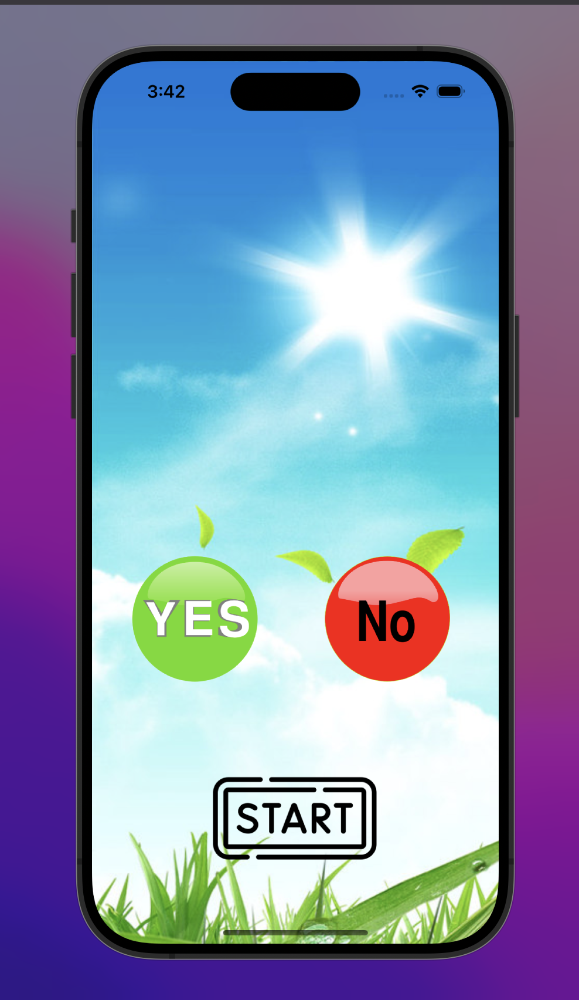
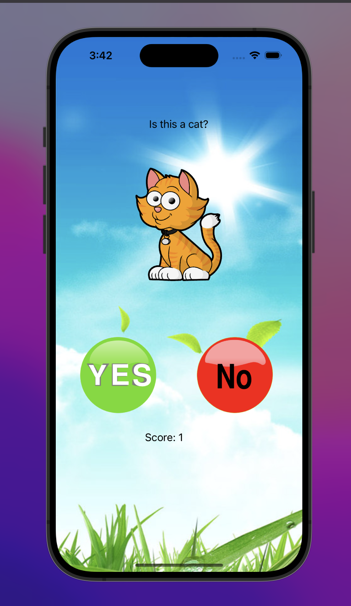
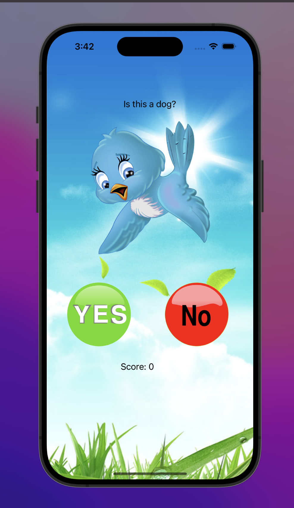
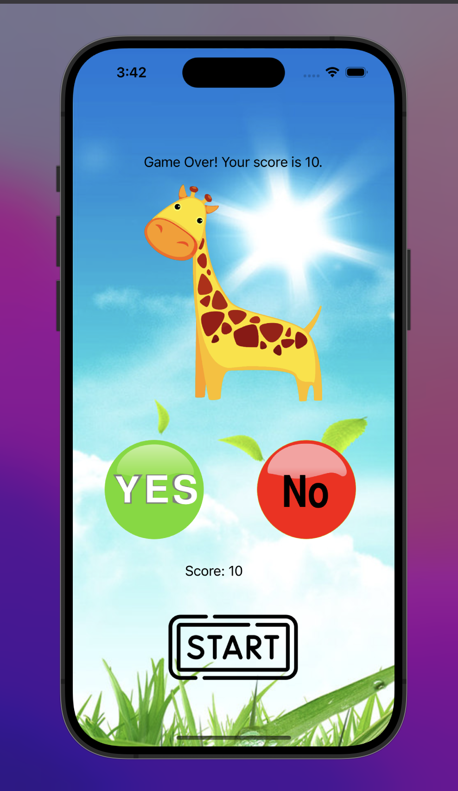

# AnimalGuess App User Guide

**Author:** Cesar Colato

---

## Introduction

"AnimalGuess" is a fun and interactive game designed for kids. The objective of the game is to correctly identify animals based on displayed images.

---

## Getting Started

1. **Launch the App**:  
   - Locate the "AnimalGuess" app icon on your device and tap on it to open the app.

2. **Start Screen**:  
   - Upon launching, you'll see a "Start" button. Tap this button to begin the game.

  

---

## How to Play

1. **View the Animal Image**:  
   - Once the game starts, an animal image will be displayed on the screen.

2. **Read the Question**:  
   - Below the image, there will be a question asking if the displayed image is of a certain animal, e.g., "Is this a bird?"

3. **Answer the Question**:  
   - Two buttons, "Yes" and "No", are provided below the question.
   - If you believe the displayed image matches the animal name in the question, tap the "Yes" button.
   - If you think it doesn't match, tap the "No" button.

4. **Correct Answer**:  
   - This is an example of the correct animal image matching the question, answering this correctly increases your score by 1.

   

5. **Wrong Answer**:  
   - This is an example of the wrong animal image matching the question, answering this correctly makes you go to the next question without increasing your score.

   

6. **Scoring**:  
   - Your score will be displayed at the bottom of the screen.
   - Every time you correctly identify an animal by pressing the "Yes" button, your score will increase by one point.
   - The game continues until you achieve a score of 10 points.

7. **Game Over**:  
   - Once you reach a score of 10 points, the game ends, and you'll see a "Game Over" message along with your final score.  
   - To play again, tap the "Start" button.

   

---

## Conclusion

"AnimalGuess" is a delightful way to test and improve your knowledge of animals. Enjoy the game, and aim for the highest score!
